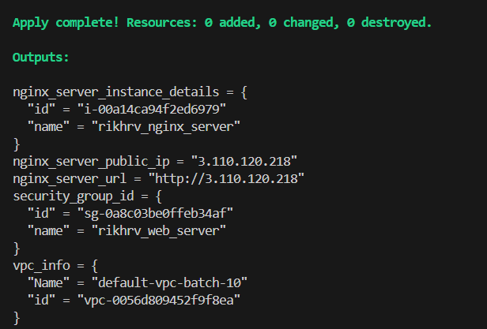
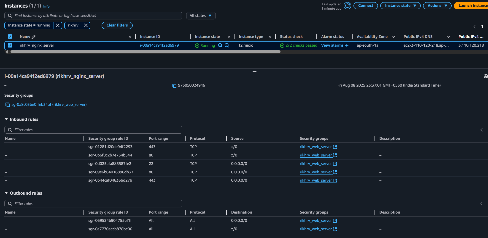
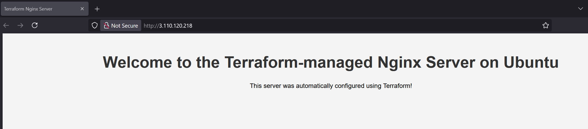
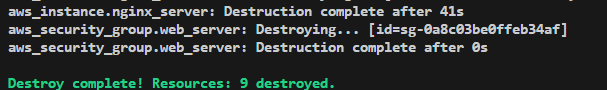

# Terraform Nginx Ubuntu Provisioning

Provision an Nginx web server on AWS EC2 using Terraform. This project ensures:

- EC2 instance is created in the default VPC
- Security group allows:
  - Inbound HTTP (port 80)
  - Inbound SSH (port 22)
- Custom Nginx welcome page is deployed

---

## 📁 Workspace Structure

```
terraform-nginx-ubuntu->
                        ├──main.tf
                        ├──variables.tf
                        ├──outputs.tf
                        ├──dev.tfvar
                        ├──README.md
                        ├──install_nginx.sh
```

---

## 🚀 Provisioning Steps

1. **Query default VPC and create security group**
2. **Query Ubuntu image** 
3. **Create custom `install_nginx.sh`** script for EC2 user data
4. **Initiate EC2 provisioning**
5. **Run the following commands:**
```bash
# Initialize Terraform for AWS
terraform init

# Preview the Terraform plan
terraform plan

# Apply the Terraform plan with variables
terraform apply -var-file="dev.tfvar"

# (Optional) Refresh state only
terraform apply -refresh-only -auto-approve
```

---

## 📦 Outputs & Verification

1. **Terraform Output after EC2 is provisioned:**

   

2. **AWS Console View:**

   

3. **Check the public IP URL:**

   

4. **Destroy the provisioned resources:**

   ```bash
   terraform destroy -var-file="dev.tfvar"
   ```
   

---

## 📝 Notes

- Ensure your AWS credentials are configured before running Terraform.
- The custom Nginx page will be available at the public IP output by Terraform.
- For troubleshooting, check the EC2 instance's `/var/log/cloud-init-output.log`.